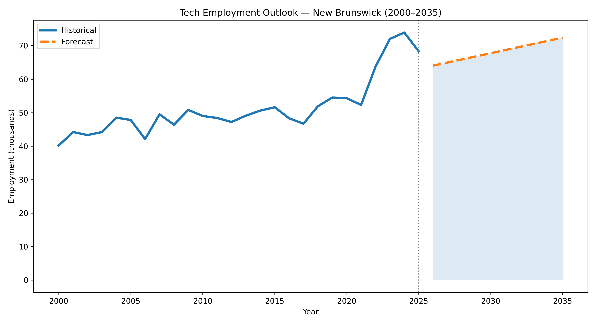
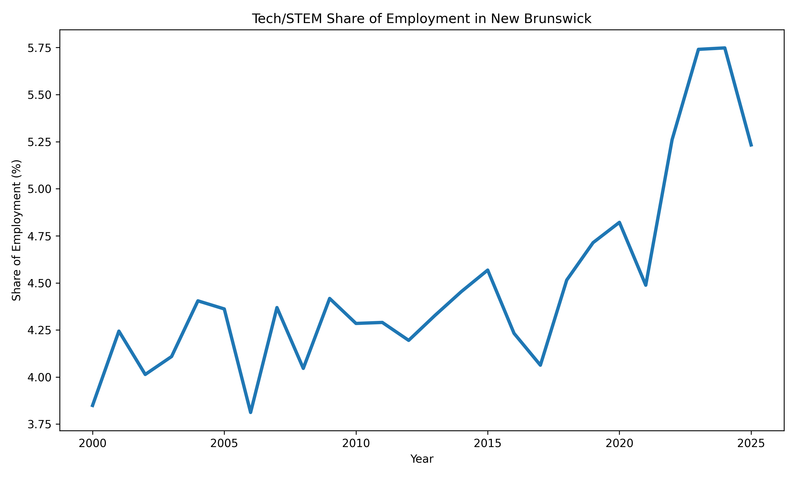
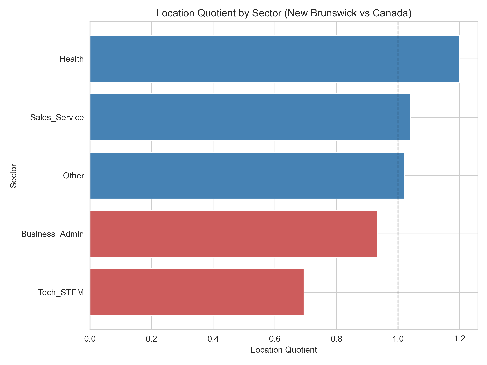
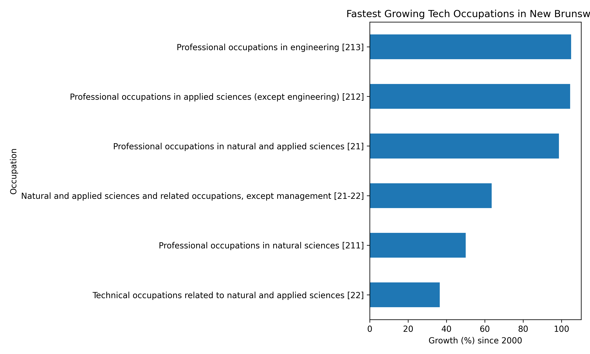

# Forecasting Emerging Tech Occupations in New Brunswick
### Capstone Project — Data Analytics & AI

This project analyzes long-term employment trends in technology-related occupations in **New Brunswick (Canada)** using official labor market data from **Statistics Canada**.

The analysis combines **data engineering, exploratory analysis, economic indicators, and machine learning forecasting** to understand how the tech workforce has evolved and how it may grow in the coming decade.

The goal is to identify **emerging technology occupations**, quantify **sector growth**, and provide **data-driven insights about the future of the tech workforce in New Brunswick**.

---

# Executive Summary

Key findings from the analysis:

- Tech/STEM employment in New Brunswick has **grown steadily since 2000**
- The tech workforce increased from **~40k workers in 2000 to ~68k in 2025**
- Tech employment represents about **5% of total employment in NB**
- Machine learning forecasting suggests **~6% additional growth by 2035**
- This corresponds to **~4,000 additional tech jobs** over the next decade

While the sector remains smaller than in major Canadian tech hubs, the data shows a **consistent structural expansion of technology-related employment in the province**.

---

# Key Research Questions

This project investigates the following questions:

- Which STEM occupations are growing fastest in New Brunswick?
- How does tech-sector growth compare with other sectors?
- How does New Brunswick’s tech workforce compare to the national average?
- What is the projected demand for tech jobs over the next decade?
- How can data analytics and machine learning support labor-market forecasting?

---

# Data Source

### Statistics Canada

**Table 14-10-0416-01 — Labour force characteristics by occupation**

Dataset characteristics:

- Coverage: Canada and provinces
- Frequency: Annual
- Period: 1987–2025
- Size: ~534,000 rows (~113MB)

Dimensions used:

- Year (`REF_DATE`)
- Geography (`GEO`)
- Occupation classification (`NOC`)
- Employment count (`VALUE`)
- Gender
- Labour force characteristic

For this project we filtered for:

- Province: **New Brunswick**
- Labour Force Characteristic: **Employment**
- Gender: **Total**

Employment values are reported in **thousands of persons**.

---

# Project Structure

```bash
capstone-nb-job-trends
│
├── data
│ ├── raw/ # Original datasets (Statistics Canada)
│ ├── interim/ # Intermediate cleaned datasets
│ └── processed/ # Final datasets used for modeling
│
├── notebooks
│ ├── 01_data_cleaning.ipynb
│ ├── 02_eda_and_features.ipynb
│ └── 03_modeling_and_forecast.ipynb
│
├── models/ # Trained machine learning models
│
├── figures/ # Visualizations generated by the project
│
├── report
│ ├── capstone_report.md
│ └── capstone_slides.pdf
│
├── requirements.txt
└── README.md
```

---

# Tech Stack

Python ecosystem:

- Python
- Pandas
- NumPy
- Matplotlib
- Seaborn
- Plotly
- Scikit-learn
- Statsmodels
- Joblib

Development tools:

- Jupyter Notebooks
- Git / GitHub
- VS Code

Optional integration:

- Large Language Models (LLMs) for narrative insights and report drafting

---

# Data Processing Pipeline

The analysis follows a structured analytics pipeline:

### 1. Data Ingestion

Raw CSV files are imported from Statistics Canada and stored in: data/raw/

---

### 2. Data Cleaning

The dataset is filtered to include:

- Province: **New Brunswick**
- Gender: **Total**
- Labour force characteristic: **Employment**

Relevant columns: REF_DATE, GEO, Occupation (NOC), VALUE

---

### 3. Feature Engineering

Additional analytical features were created:

- `sector_group`
- `tech_indicator`
- `year_over_year_change`
- `rolling_mean`
- `growth_rate`

Occupations were grouped into broader sectors:

- Tech / STEM
- Health
- Business / Finance
- Sales / Services
- Other

---

### 4. Exploratory Data Analysis

EDA focuses on identifying long-term labor market patterns:

- Employment trends by sector
- Growth rates by occupation
- Structural changes in employment composition
- Identification of emerging occupations

---

# Key Visualizations

## Tech Employment Growth



This chart shows the historical evolution of tech employment and projected growth through 2035.

---

## Tech Share of Total Employment



The share of tech employment has increased from roughly **3.8% in 2000 to more than 5% today**, indicating a gradual structural shift toward a more technology-driven economy.

---

## Location Quotient (NB vs Canada)



Location Quotient analysis compares the concentration of sectors in New Brunswick relative to Canada.

Values above **1.0** indicate higher local specialization.

---

## Fastest Growing Tech Occupations



Engineering and applied science occupations show the strongest long-term growth.

---

# Machine Learning Forecast

A regression model was trained to estimate future employment levels.

Model used:

- **Linear Regression**

Features:

- Year
- Historical employment trend

### Forecast horizon: 2026 - 2035

---

Projected growth:

- **~6% increase by 2035**
- **~4,000 additional tech jobs**

---

# Economic Interpretation

The results suggest several structural trends:

1. **Technology employment is steadily expanding in New Brunswick**
2. Growth is strongest in **engineering and applied sciences**
3. The province remains **less specialized in tech than the national average**
4. There is **significant room for expansion of the technology sector**

These findings may support:

- workforce planning
- education policy
- economic development strategies

---

# Reproducibility

To run the project locally:
```
git clone https://github.com/edhdevps/capstone-nb-job-trends.git

cd capstone-nb-job-trends

python -m venv venv

venv\Scripts\activate

pip install -r requirements.txt

jupyter notebook

Then run the notebooks in order:

01_data_cleaning.ipynb
02_eda_and_features.ipynb
03_modeling_and_forecast.ipynb
```

---

# Future Improvements

Potential extensions for the project:

- More advanced forecasting models (ARIMA / Prophet)
- Integration of wage and income data
- Regional analysis by census metropolitan areas
- Industry-level analysis
- Interactive dashboards (Power BI / Streamlit)

---

# Author

Eduardo Silva  
Data Analytics & AI Student  

GitHub:  
https://github.com/edhdevps

---

# License

This project uses public data from **Statistics Canada**.